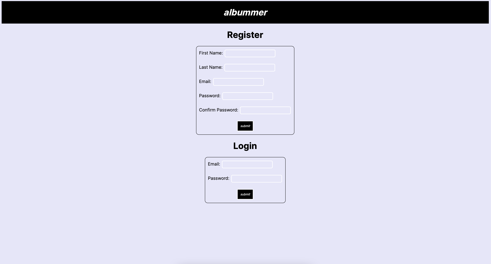
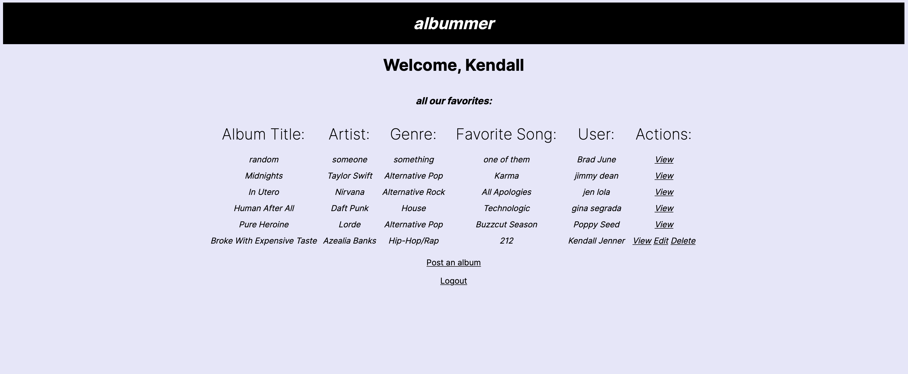
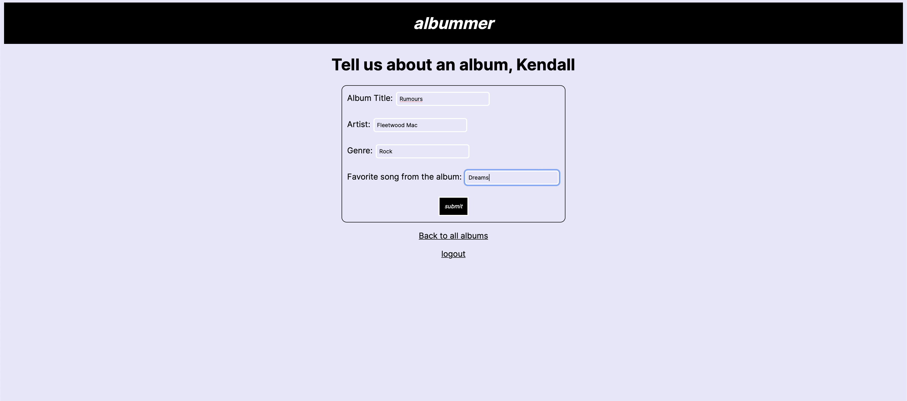
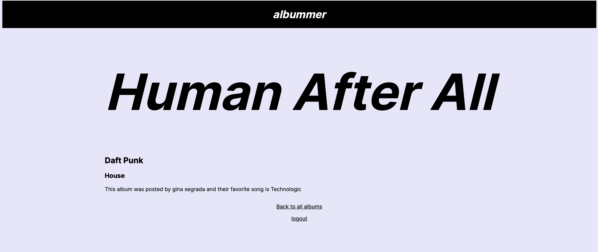

# Albummer

Full Stack Web application that allows users to login/register and post an album of their choosing. They can view other users posts, as well as delete and edit their own. 

### Tech used:
<!--  -->
[![Python][Python]][Python-url]
[![Flask][Flask]][Flask-url]
[![MySQL][MySQL]][MySQL-url]
[![HTML/JSP][HTML]][HTML-url]
[![CSS][CSS]][CSS-url]
[![Jinja][Jinja]][Jinja-url]
[![Visual Studio Code][VS]][VS-url]

### Screenshots:

<!-- MARKDOWN LINKS & IMAGES -->
<!-- https://www.markdownguide.org/basic-syntax/#reference-style-links -->
[CSS]: https://img.shields.io/badge/CSS-blue?logo=css3
[CSS-url]: https://developer.mozilla.org/en-US/docs/Web/CSS
[HTML]: https://img.shields.io/badge/-HTML-orange?logo=HTML5
[HTML-url]: https://developer.mozilla.org/en-US/docs/Web/HTML
[Python]:https://img.shields.io/badge/-Python-orange?logo=python
[Python-url]: https://docs.python.org/3/
[Jinja]: https://img.shields.io/badge/-Jinja-red?logo=jinja
[Jinja-url]: https://img.shields.io/badge/-Jinja-red?logo=jinja](https://jinja.palletsprojects.com/en/3.1.x/)
[Flask]: https://img.shields.io/badge/-Flask-red?logo=flask
[Flask-url]: https://flask.palletsprojects.com/en/2.2.x/
[VS]:https://img.shields.io/badge/-VisualStudio-black?logo=visualstudiocode
[Vs-url]: https://code.visualstudio.com/
[MySQL]: https://img.shields.io/badge/MySQL-grey?logo=mysql
[MySQL-url]: https://dev.mysql.com/doc/
